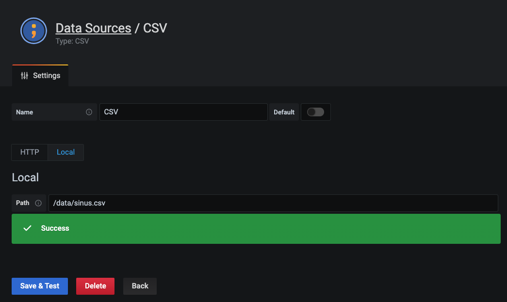

# simple-grafana-demo

This is a simple Grafana demo using docker-compose

## Install CSV plugin

Unpack the zip in the `plugins` folder like described in [https://grafana.com/grafana/plugins/marcusolsson-csv-datasource/?tab=installation](https://grafana.com/grafana/plugins/marcusolsson-csv-datasource/?tab=installation).

## Run the demo

Run the demo like this:

```bash
docker-compose up
```

Hitting Control-C will stop it.

## Log in to Grafana

Call `localhost:3000` and log in with `admin` and `admin1234`. 

## Use CSV plugin

Add a local CSV as datasource like this:


